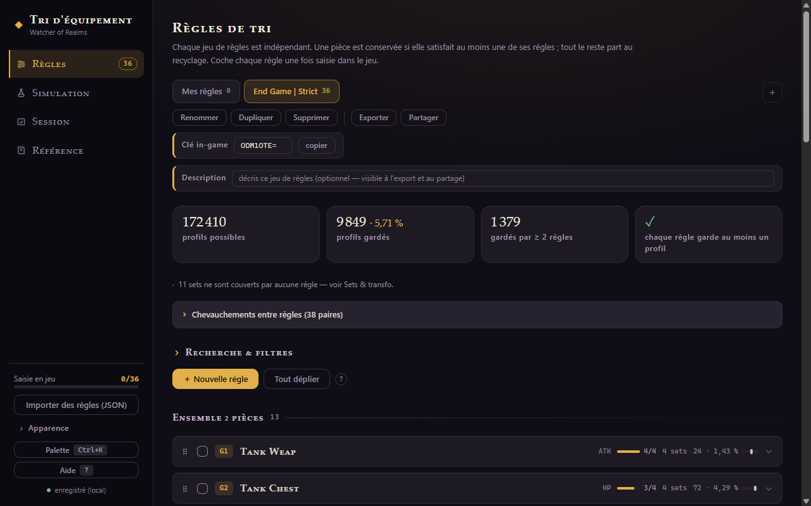
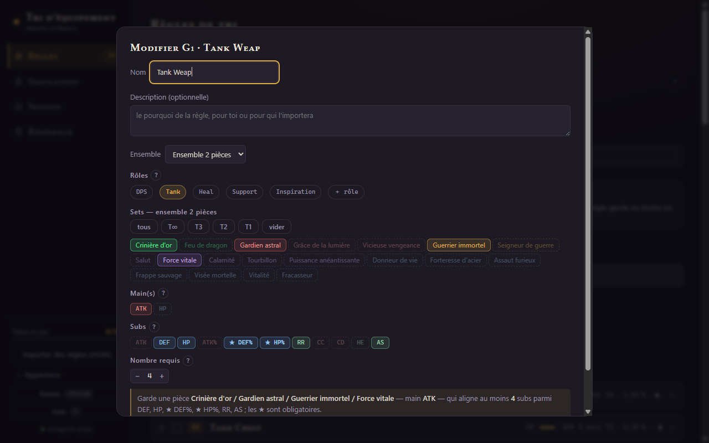
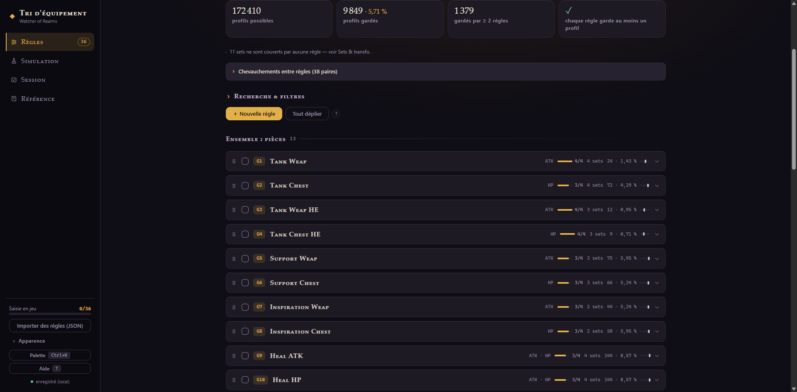
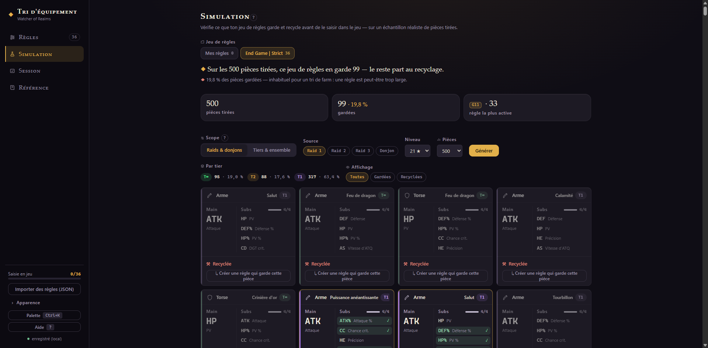
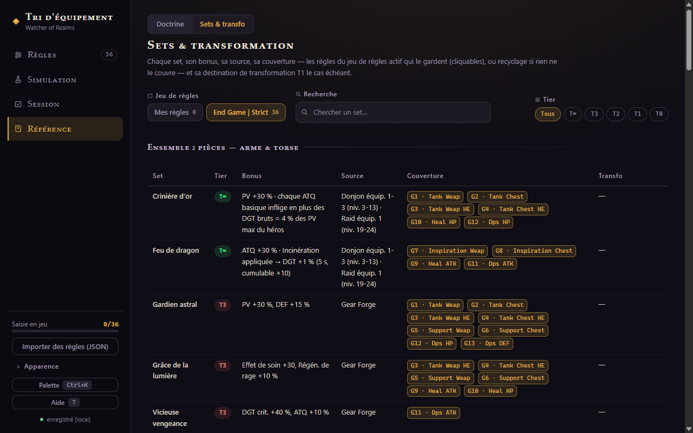
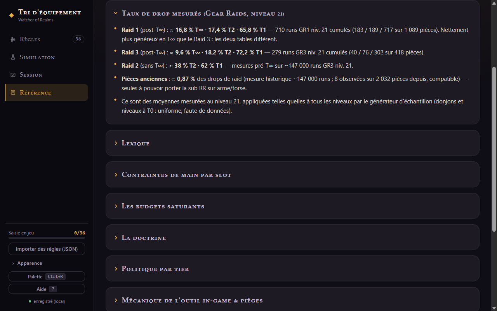
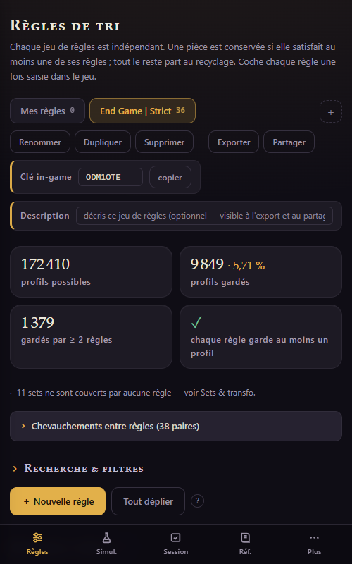

<div align="center">

# ◆ WoR Gear Builder

**Gestionnaire de règles de tri d'équipement pour Watcher of Realms**

Construis tes règles tranquillement hors du jeu, mesure exactement ce qu'elles gardent
et ce qu'elles recyclent, puis recopie-les dans le builder in-game.

[](https://benb-code.github.io/wor-gear-builder/)

[](wor-regles-tri.html)




*Envie d'essayer avec de vraies règles ? [Ce lien](https://tinyurl.com/WoR-526bsr) importe un set
end game strict (36 règles) avec sa clé d'import in-game prête à copier.*

</div>

---

## Pourquoi

Le builder de tri in-game est puissant mais aveugle : on saisit ses règles une à une, sans
jamais savoir ce qu'elles vont réellement garder, ce qui fait doublon, ni ce qui part au
recyclage par accident. Cet outil permet de concevoir son jeu de règles à tête reposée,
de le **vérifier mathématiquement**, de **simuler son farm**, puis de tout ressaisir en jeu
en cochant les règles au fur et à mesure.

## 📖 Documentation

Un guide complet, partie par partie, vit dans [`docs/`](docs/README.md) :

| | | |
|---|---|---|
| [1 · Premiers pas](docs/guide-01-demarrage.md) | [2 · Les règles](docs/guide-02-regles.md) | [3 · Le Testeur](docs/guide-03-testeur.md) |
| [4 · Sets & transformations](docs/guide-04-sets-transfo.md) | [5 · Partager & sauvegarder](docs/guide-05-partage.md) | [6 · Référence & données](docs/guide-06-donnees.md) |

## Fonctionnalités

### ✍️ Des règles fidèles à la sémantique du jeu

Sets ciblés, main(s), pool de subs avec ★ obligatoires, nombre requis — la logique de
matching reproduit celle du builder officiel (confirmée in-game) : chaque ★ est obligatoire,
le requis se compte sur toute la liste ★ incluses, et le main effectif d'une pièce est
neutralisé de ses critères de subs. Sets classés par tier (T0 → T∞) avec sélection rapide,
rôles libres pour filtrer, drag & drop pour ordonner.

<div align="center"></div>

### 🧪 Couverture exhaustive — les 172 410 profils possibles

Le Testeur énumère **tous** les profils de pièces possibles (sets × slots × mains légaux ×
combinaisons de 4 subs) et les passe dans tes règles. Tu sais ce que tu gardes, ce qui
chevauche, quelles règles ne servent à rien — et quand une règle fait **doublon**, l'outil
liste les règles qui la recouvrent, cliquables.

<div align="center"></div>

### 🎲 Simulation de farm aux taux mesurés

Génère des échantillons de pièces par **raid ou donjon d'équipement et par niveau**.
En Gear Raid, le tirage est pondéré par des taux mesurés en jeu (voir tableau plus bas),
pièces anciennes comprises — et le résultat affiche la répartition par tier obtenue.

<div align="center"></div>

### 📚 Les 48 sets & leurs transformations

Bonus, source de drop avec tranches de niveaux, destination de transformation T1, et pour
chaque set : les règles de ton onglet qui le couvrent — ou l'avertissement qu'il part
intégralement au recyclage.

<div align="center"></div>

### 📄 Référence & doctrine

Lexique, budgets saturants, doctrine par archétype, politique par tier, contraintes de
mains par slot (éditables dans le Testeur si le jeu te contredit) — et les taux de drop
mesurés avec leur provenance.

<div align="center"></div>

### 🔗 Partage

- **Lien court** (`https://tinyurl.com/WoR-xxxxxx`) qui importe l'onglet complet chez le
  destinataire — règles compressées dans le fragment d'URL, rien ne transite par un serveur
  applicatif ;
- **Clé d'import in-game** attachée à chaque onglet : elle voyage avec le lien, le
  destinataire n'a qu'à la copier-coller dans le jeu ;
- **Export / import JSON** pour l'archivage ;
- **Impression** propre du jeu de règles pour le ressaisir en jeu.

### 📱 Et aussi



- Interface **FR / EN** (auto-détectée, choix mémorisé) ;
- **Mobile** : tout fonctionne au pouce, tables adaptées ;
- Thème clair / sombre, 5 accents de couleur, densité confort / compacte ;
- Suivi « saisie en jeu » : coche chaque règle recopiée, la barre de
  progression suit ;
- Testeur de **pièce manuelle** : décris un drop réel, l'outil dit quelle
  règle le garde et pourquoi ;
- Plusieurs onglets = plusieurs jeux de règles indépendants.

<br clear="right">

## Taux de drop intégrés

Mesures au **niveau 21**, appliquées à tous les niveaux par le générateur d'échantillon
(donjons et niveaux à T0 : tirage uniforme, faute de données).

| Source | T∞ | T2 | T1 | Provenance |
|---|---|---|---|---|
| Gear Raids 1 & 3 (post-T∞) | ≈ 10,3 % | ≈ 20,6 % | ≈ 69,1 % | 40 runs GR3 niv. 21 — préliminaire, à affiner |
| Gear Raid 2 (sans T∞) | — | ≈ 38 % | ≈ 62 % | ~147 000 runs GR3 niv. 21, pré-T∞ (même table) |

**Pièces anciennes** : ≈ 0,87 % des drops de raid — les seules à pouvoir porter la sub RR
sur arme et torse ; simulées par le générateur.

> 📊 **Tu as des relevés de drops ?** Ouvre une issue ! Plus l'échantillon grossit, plus
> la simulation est fiable.

## Données & vie privée

Tout vit dans le navigateur (`localStorage`) : aucun compte, aucun serveur, aucune donnée
envoyée. Seule exception, au clic « Partager » : l'appel au raccourcisseur d'URL
(TinyURL, repli da.gd), avec repli automatique sur un lien long si le service est
injoignable.

## Développement

Toute l'app tient dans **un seul fichier** ([`wor-regles-tri.html`](wor-regles-tri.html)) :
vanilla JS/CSS, zéro dépendance, zéro build — on l'ouvre dans un navigateur et c'est tout.

```bash
# vérifier la syntaxe après modification
node --check <(sed -n '/<script>/,/<\/script>/p' wor-regles-tri.html | sed '1d;$d')
```

Invariant de test du moteur : la couverture exhaustive doit toujours compter
**172 410 profils**. Les conventions et pièges connus sont documentés dans les notes de
dev du dépôt.

Issues, PR, données de drops et retours de terrain bienvenus 🙌
