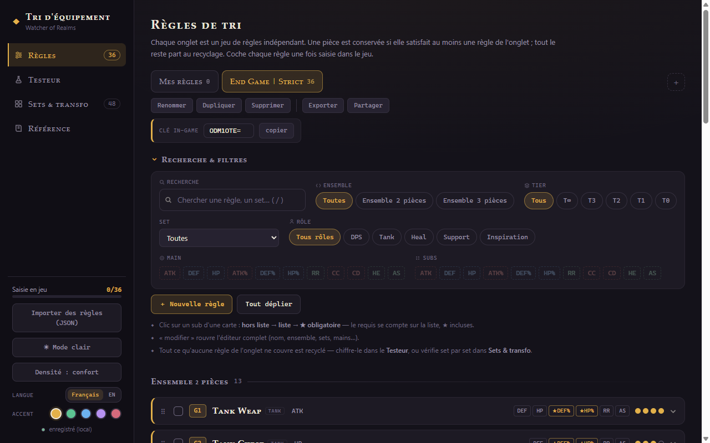

# 2 · Les règles

## Anatomie d'une règle

Une règle dit : *« garde les pièces de **ces sets**, dont le main est **l'un de ceux-ci**,
qui portent au moins **N** subs parmi **cette liste**, dont obligatoirement **les ★** »*.

| Champ | Rôle |
|---|---|
| **Ensemble** | 2 pièces (arme, torse) ou 3 pièces (bracelet, collier, bague) — une règle vit d'un seul côté |
| **Rôles** | étiquettes libres (DPS, Tank, Heal… + les tiennes) — servent uniquement à filtrer |
| **Sets** | les sets ciblés, classés par tier avec sélection rapide (`tous`, `T∞`, `T3`…) |
| **Main(s)** | les mains acceptés, en OU — le main effectif d'une pièce est **ignoré de ses critères de subs** |
| **Subs** | le pool : clic pour cycler `hors liste → liste → ★ obligatoire` |
| **Requis** | le nombre de subs de la liste que la pièce doit porter, **★ incluses** |

La sémantique est celle du builder in-game (confirmée en jeu) : chaque ★ est obligatoire,
le requis se compte sur toute la liste, et si les ★ suffisent à l'atteindre, les positions
restantes de la pièce sont libres.

> ⚠️ L'éditeur t'avertit si une règle est **injouable** (requis > taille de la liste) ou si
> les ★ suffisent déjà au requis (les autres subs de la liste ne filtrent alors plus rien).

## Créer une règle

**＋ Nouvelle règle** ouvre l'éditeur. L'ordre des champs suit celui du builder in-game :
nom/ensemble → rôles → sets → mains → subs → requis, pour recopier sans gymnastique.

Les règles reçoivent un identifiant **G1, G2…** (ensemble 2 pièces) ou **D1, D2…**
(3 pièces), numéroté par onglet.

## Modifier vite, directement sur la carte

Déplie une carte (clic) : tu peux **cycler les subs**, ajuster le **requis** (stepper),
toggler les **rôles** — sans rouvrir l'éditeur. « modifier » rouvre l'éditeur complet
(nom, ensemble, sets, mains). « dupliquer » clone la règle pour décliner une variante.

- **Réordonner** : poignée ⠿ en début de carte, glisser-déposer ;
- **Tout déplier / replier** : bouton au-dessus de la liste.

## Chercher et filtrer

L'accordéon **Recherche & filtres** combine : recherche texte (raccourci **`/`**),
ensemble 2/3 pièces, tier, set précis, rôle, et pastilles Main / Subs (une règle ne reste
affichée que si elle porte toutes les stats cochées). Le badge sur le titre rappelle
combien de filtres sont actifs quand l'accordéon est replié.

## Suivre la saisie en jeu

Chaque carte a une **case à cocher** : coche-la quand tu as recopié la règle dans le
builder du jeu. La barre de progression de la barre latérale suit, par onglet. Pratique
pour reprendre une saisie interrompue — ou pour l'impression (voir
[guide 5](guide-05-partage.md#imprimer)).

---

[← Premiers pas](guide-01-demarrage.md) · [Sommaire](README.md) · [Le Testeur →](guide-03-testeur.md)
