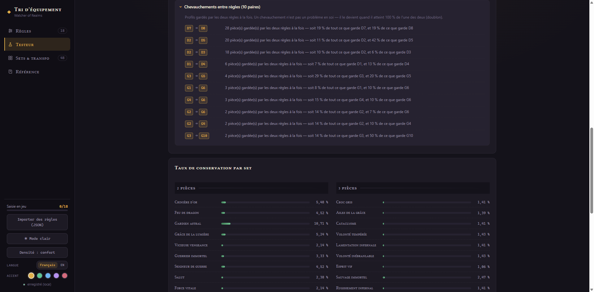
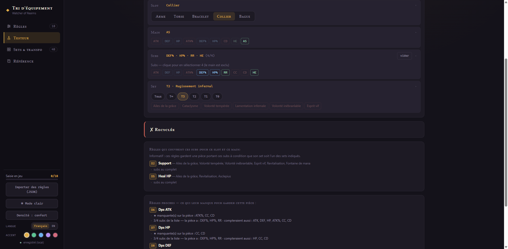
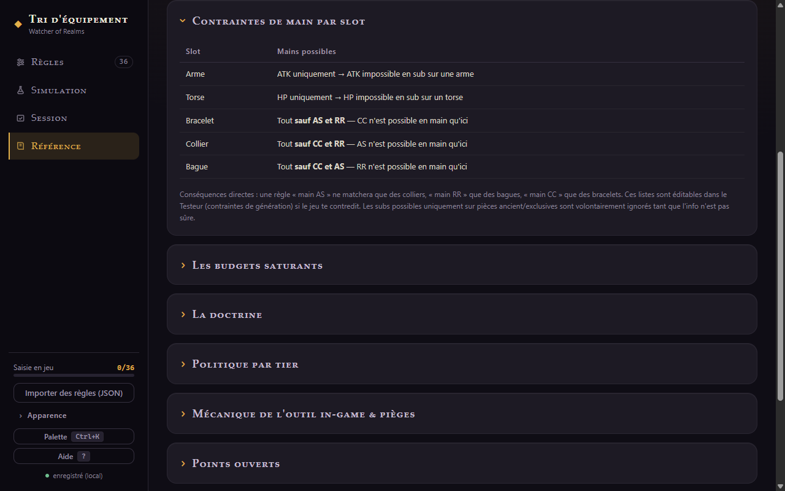

# 3 · Le Testeur

Trois modes pour répondre à trois questions : **Couverture** (« mes règles sont-elles bien
conçues ? »), **Échantillon** (« que va donner mon farm ? »), **Pièce manuelle** (« et ce
drop précis, il passe ? »). Le sélecteur d'onglet en haut choisit l'ensemble testé.

## Couverture — l'audit exhaustif

L'outil énumère **tous les profils de pièces possibles** — 172 410 (sets × slots × mains
légaux × combinaisons de 4 subs) — et les passe dans tes règles. Chaque profil compte pour
un : c'est une mesure de *conception*, pas de fréquence de drop.

Les quatre cartes : total de l'espace, profils **gardés** (avec le % de tout ce qui peut
dropper), profils gardés par **2 règles ou plus** (chevauchement), règles qui **ne gardent
rien**.

Le tableau **« Ce que chaque règle attrape »** donne par règle : pièces gardées, la part
parmi les pièces des sets qu'elle cible, et une **Lecture** :

- `ok` — la règle travaille ;
- `ne garde rien` — vérifie ses critères (souvent : ★ + main incompatibles, ou requis trop haut) ;
- `doublon — tout ce qu'elle garde l'est déjà par : G2 …` — les règles qui la recouvrent
  sont listées, **cliquables** pour y aller directement.

> 💡 Une règle quad très stricte qui ne garde que quelques profils sur des milliers, c'est
> **voulu**, pas cassé. Les deux vrais signaux d'alerte sont « ne garde rien » et « doublon ».

L'accordéon **« Chevauchements entre règles »** liste chaque paire de règles qui gardent
des pièces en commun : le nombre de profils partagés, et ce que ça pèse en % de chacune des
deux règles. Un chevauchement n'est pas un problème en soi — il le devient quand il atteint
100 % de l'une des deux (doublon).

Plus bas : le **taux de conservation par set** (barres, dans l'ordre in-game) et
l'accordéon des **sets non couverts** — tout ce qui part intégralement au recyclage.

## Échantillon — la simulation de farm

Génère 100 / 500 / 2 000 pièces aléatoires et regarde ce que tes règles en gardent. Deux
façons de définir le scope, **exclusives** :

- **Raids & donjons** *(recommandé)* : choisis ta source de farm (Raid 1/2/3, Donjon) et
  un niveau. En Gear Raid, le tirage est **pondéré par les taux de drop mesurés**
  (niveau 21 ★ — voir [guide 6](guide-06-donnees.md)), pièces anciennes comprises
  (~0,87 %, seules à porter la sub RR sur arme/torse) ;
- **Tiers & ensemble** : coche librement des tiers et un côté — tirage uniforme.

Le bloc **Résultat** donne le % gardé et la **répartition par tier** de l'échantillon.
Clique une carte de pièce pour voir **pourquoi** elle est gardée ou recyclée, règle par
règle (★ manquantes, main non accepté…).

> ⚠️ Les taux sont des moyennes : ton échantillon fluctuera autour — comme ton farm réel.

## Pièce manuelle — vérifier un drop précis

Tu viens de looter une pièce et tu hésites à la garder ? Décris-la dans le **stepper** —
quatre étapes (slot → main → subs → set), sélection par pastilles, filtre des sets par tier,
chaque étape repliée affiche son résumé. Dès 4 subs et un set choisis, le **verdict** tombe :
gardée par telle règle, ou recyclée.

Deux panneaux accompagnent le verdict :

- **Règles qui couvrent ces subs** *(dès 2 subs saisies)* — les règles compatibles avec ce
  slot, ce main et ces subs, qui garderaient la pièce **si son set était l'un des leurs** ;
  pour chacune, ce qui manque encore est détaillé (sub du pool à compléter, ★ obligatoire
  absente). C'est ainsi qu'une pièce peut être « recyclée » tout en ayant ses subs couvertes :
  seul son set ne fait partie d'aucune règle ;
- **Règles proches** — celles qui ratent la pièce de peu, avec **chaque raison d'échec**
  listée (★ manquante, main refusé, requis non atteint…). Les identifiants de règles sont
  cliquables partout — parfait pour découvrir qu'une règle mériterait un ajustement.

## Contraintes de génération

Le panneau en bas du Testeur liste les **mains possibles par slot** (arme = ATK,
torse = HP, exclusivités CC/AS/RR à droite…). Ces listes alimentent la couverture et le
générateur — elles sont **éditables** si le jeu te contredit un jour, avec un bouton pour
revenir aux défauts.

---

[← Les règles](guide-02-regles.md) · [Sommaire](README.md) · [Sets & transformations →](guide-04-sets-transfo.md)
