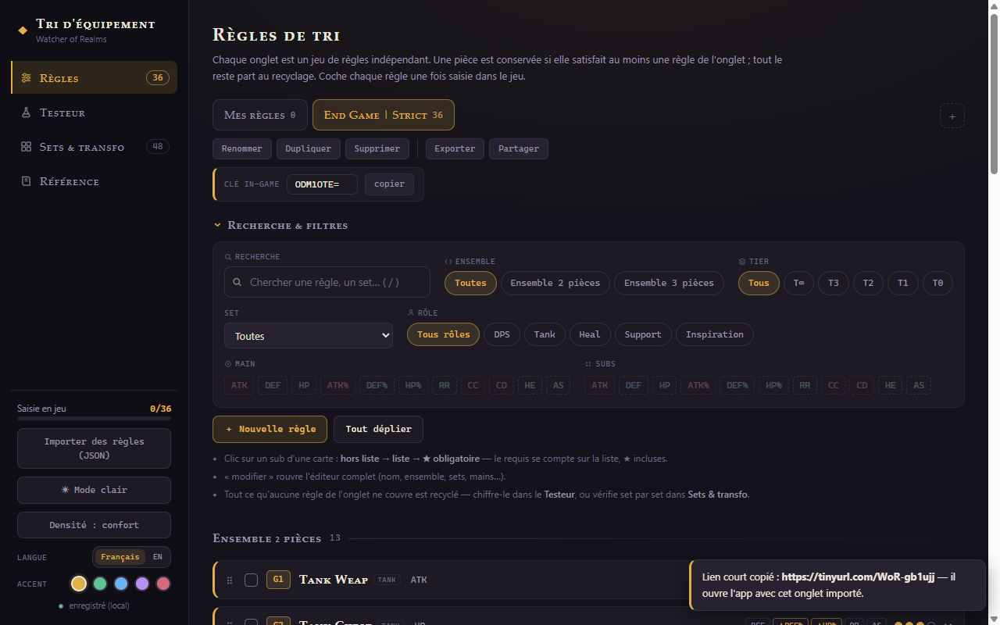

# 5 · Partager & sauvegarder

## Le lien court

Le bouton **Partager** de la barre d'onglets fabrique un lien du type
`https://tinyurl.com/WoR-xxxxxx` et le copie dans ton presse-papier. Celui qui l'ouvre
reçoit **une copie complète de l'onglet** (règles, nom, clé in-game) importée dans un
nouvel onglet chez lui — ses propres ensembles ne sont pas touchés.

Comment ça marche : les règles sont compressées **dans le fragment du lien lui-même**
(`#/import=…`) — aucune donnée n'est stockée sur un serveur applicatif, le raccourcisseur
ne fait que rediriger. Si le raccourcisseur est injoignable, l'app copie automatiquement
le lien long (même contenu, juste moins joli).

## La clé in-game

Le jeu a son propre système de partage par code. Le champ **Clé in-game** sous les boutons
d'onglet permet de noter ce code pour l'ensemble courant :

- il est **persisté** avec l'onglet et copiable en un clic ;
- il **voyage avec le lien de partage et l'export JSON** : la personne qui importe ton
  ensemble récupère la clé prête à coller dans le jeu — le combo idéal étant *lien pour
  étudier les règles + clé pour les importer in-game en trois secondes*.

## Export / import JSON

- **Exporter** (barre d'onglets) télécharge l'onglet courant en fichier JSON — c'est le
  format d'archivage et de sauvegarde de secours ;
- **Importer des règles (JSON)** (barre latérale) recharge un fichier exporté, dans un
  nouvel onglet. Les vieux exports restent compatibles.

> 💡 Tes données vivent uniquement dans ton navigateur : un export JSON de temps en temps
> te protège d'un nettoyage de données de site un peu enthousiaste.

## Imprimer

`Ctrl+P` (ou Imprimer dans le menu du navigateur) depuis n'importe quelle page : l'app
génère une **vue d'impression dédiée** de l'onglet courant — règles groupées par ensemble,
★ et requis lisibles, mention « saisie » sur celles déjà cochées. Idéal en second écran ou
sur papier pendant la recopie in-game.

---

[← Sets & transformations](guide-04-sets-transfo.md) · [Sommaire](README.md) · [Référence & données →](guide-06-donnees.md)
